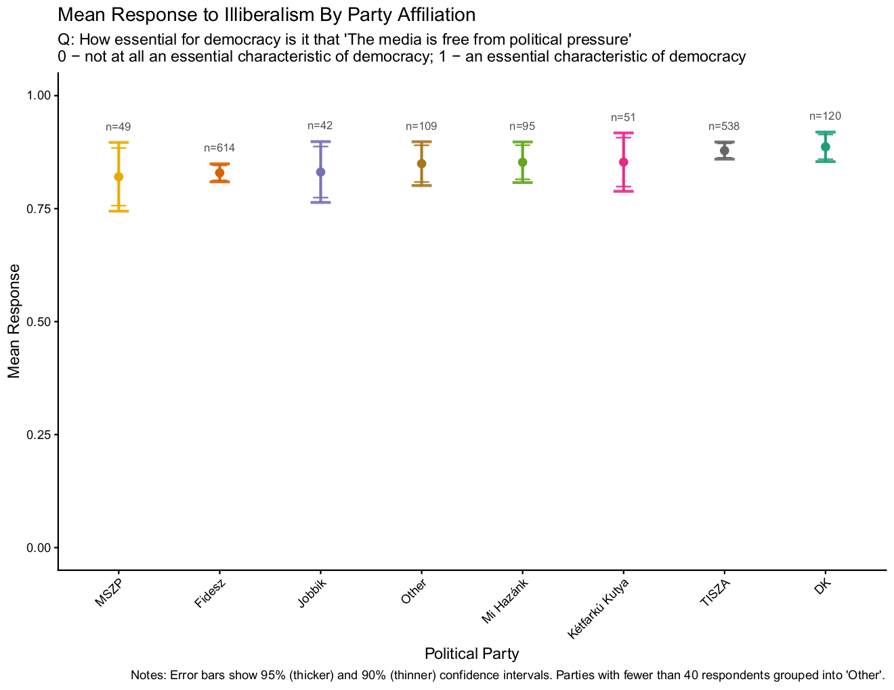
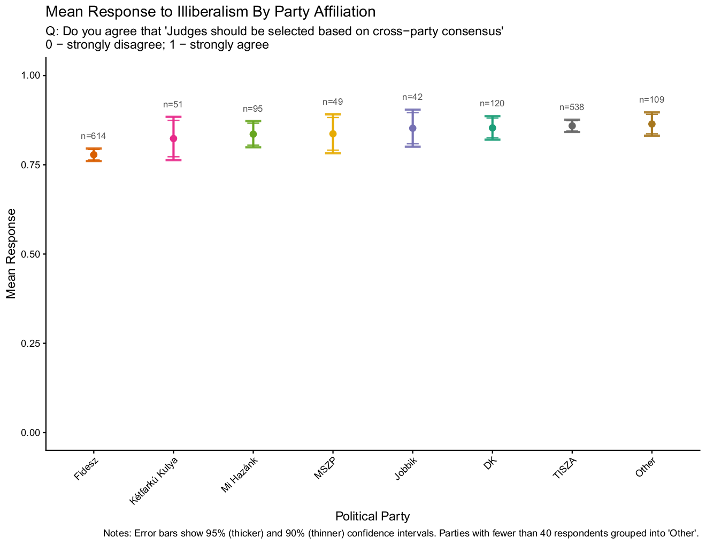
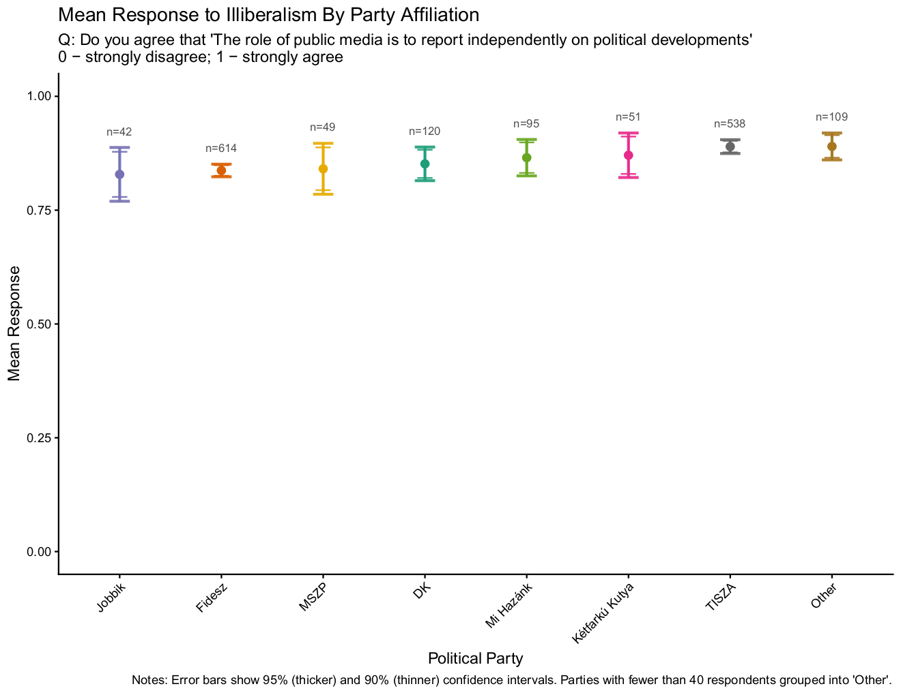
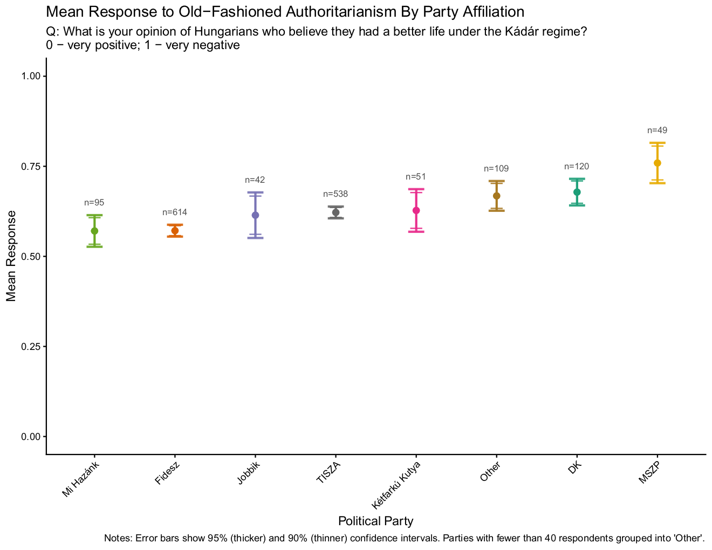
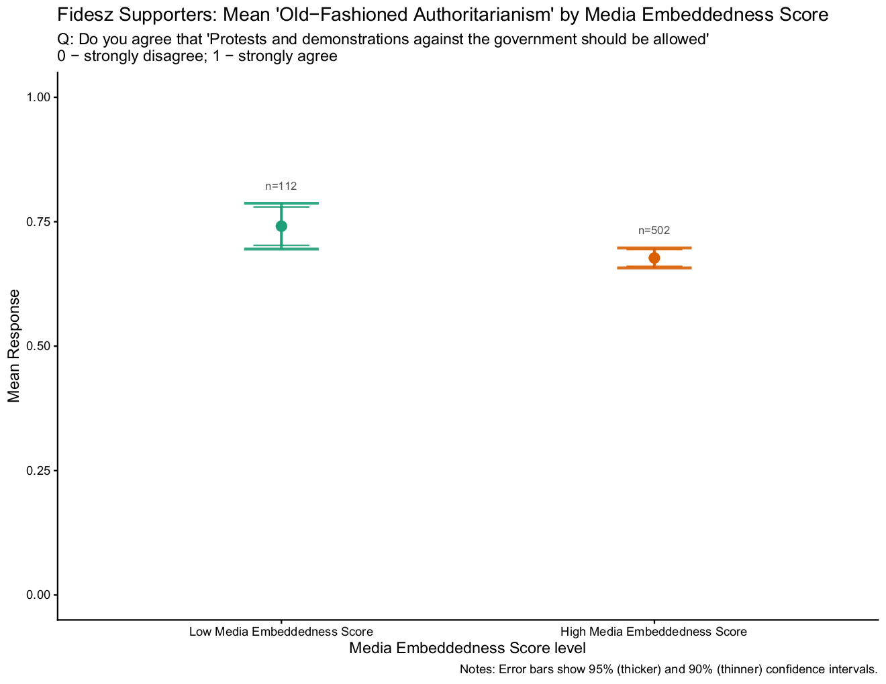
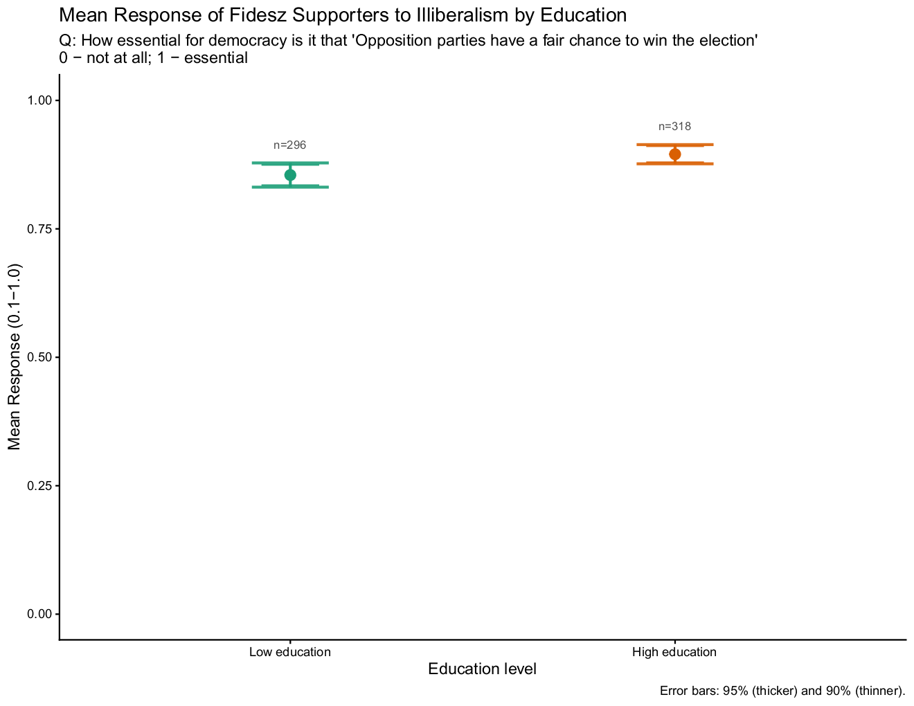
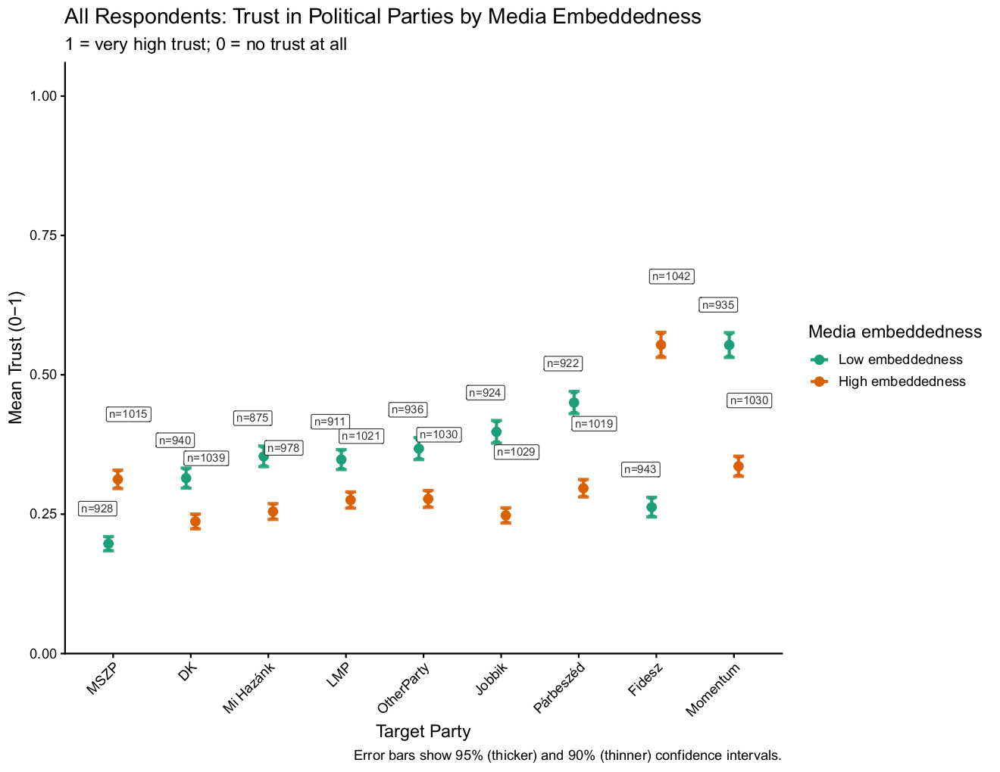
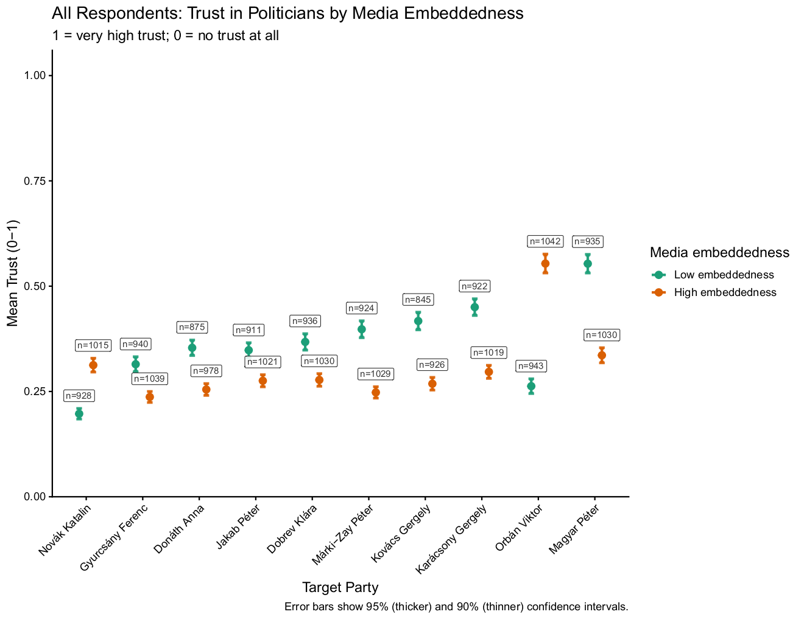
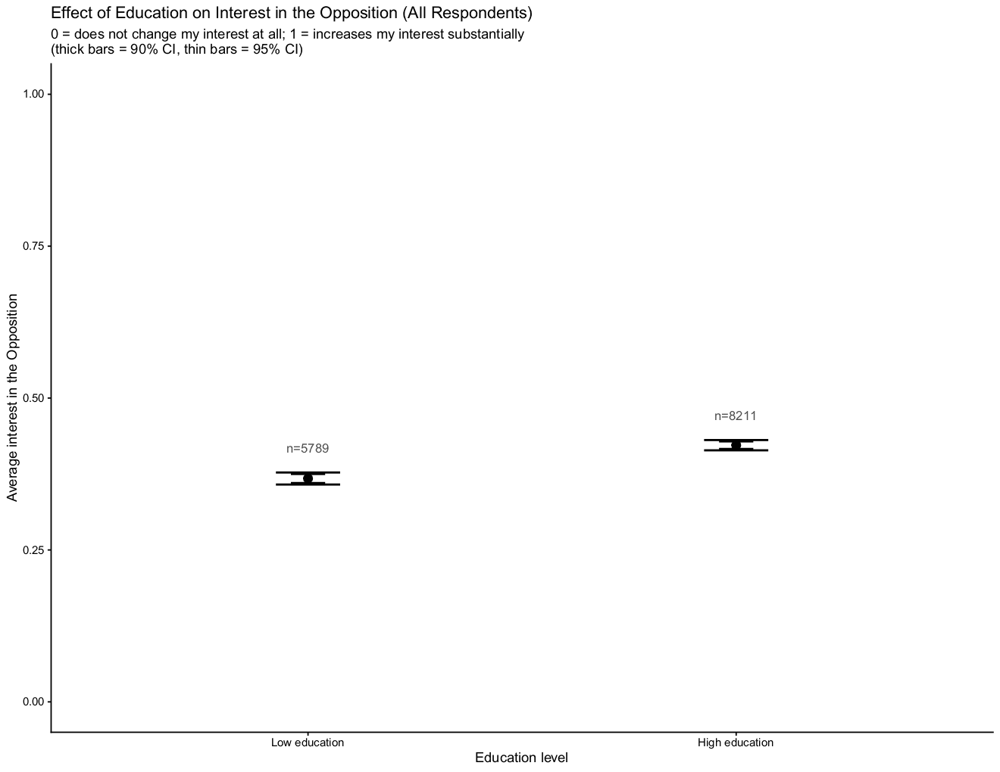
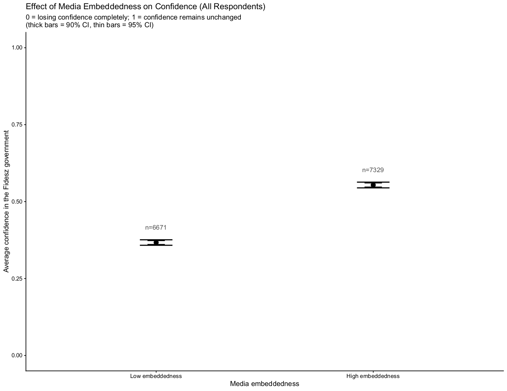

# Is-Popular-Support-for-Democratic-Backsliding-a-Problem-of-Information
This project seeks to understand how (and if) information breakthroughs affect the political beliefs and system confidence of citizens in the midst of global democratic decline. We address this question using a large-scale, nationally representive, in-person information experiment conducted in HUngary in 2025 (n = 2000). We experimentally vary exposure to two dosages of each information treatment and examine their effects on confidence in the governing regime and interest in opposition parties, conditioned on respondents' degree of embeddedness in government-aligned media ecosystems. Our findings offer little support for the expectation that informational corrections undermine regime support.

This article was a collaboration between Professors Laura Jakli and Jason Wittenberg, where I served as lead Research Associate. During the explorative stage of the project where we want to analyze various facets of the data to understand what interesting patterns might arise from the survey responses, I developed the R code that translate the survey data into visualizations for interpretation and analysis. Below is a sample of some of the plots I created and directions to the code I developed to create these plots. 

One question that we wanted to investigate was whether Fidesz supporters differed from other Hungarian citizens in terms of their opinions on various facets of old-fashioned authoritarianism versus new-style illiberal democracy. To do so, I grouped respondents by their party affiliation and compared each group's average responses to a battery of old-fashion authoritarian and new-style illiberal questions. Below are four examples of these survey results below and you can find the code I developed [here](https://github.com/vi-le-16/Is-Popular-Support-for-Democratic-Backsliding-a-Problem-of-Information/blob/main/illiberal_scale_workspace.R). 

We also wanted to compare the opinions on various facets of old-fashioned authoritarianism versus new-style illiberal democracy between Fidesz party supporters who were (1) highly embedded in government-aligned media ecosystems and those who were less embedded and (2) those who were more educated versus less educated. Below are a two examples of the results from the analysis of these demographic facets and you can find the code I developed to generate these results [here](https://github.com/vi-le-16/Is-Popular-Support-for-Democratic-Backsliding-a-Problem-of-Information/blob/main/illiberal_scale_workspace.R).

To further our understanding of the effect of these government-aligned media ecosystems on perceptions of the governing regime and its opposition, I compared the difference in degrees of trust that high government-media embedded respondents and low government-media respondents embedded had in various political parties and political leaders. We found that those who are highly government-media embedded express views that are in congruence with rhetoric of the Fidesz-controlled media, which demonstrates that propaganda does have an effect since this doesn’t hold true for those that are low media-embedded. Below are two examples of the results from this analysis; you can find the code I developed to generate these results [here](https://github.com/vi-le-16/Is-Popular-Support-for-Democratic-Backsliding-a-Problem-of-Information/blob/main/fidesz_trust_in_parties.R). 

 

To analyze whether our treatments, the two different dosages of information, had any effects on the respondents, we aggregated treatment effects across all 7 waves of treatments to see the effect they had on (1) interest in the opposition (2) confidence in the government. For more specified analysis, we drew comparisons across various demographic facets, including (1) high versus low education and (2) high versus low government-media embeddedness. Below are two examples of the results from this analysis; you can find the code I developed to generate these results [here](https://github.com/vi-le-16/Is-Popular-Support-for-Democratic-Backsliding-a-Problem-of-Information/blob/main/all_respondents_various_effects.R).

